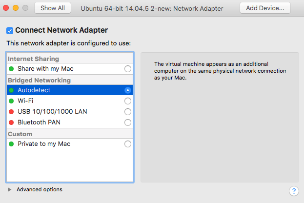
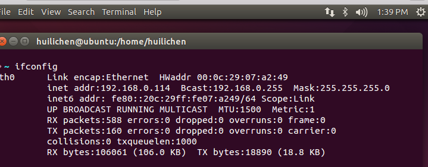
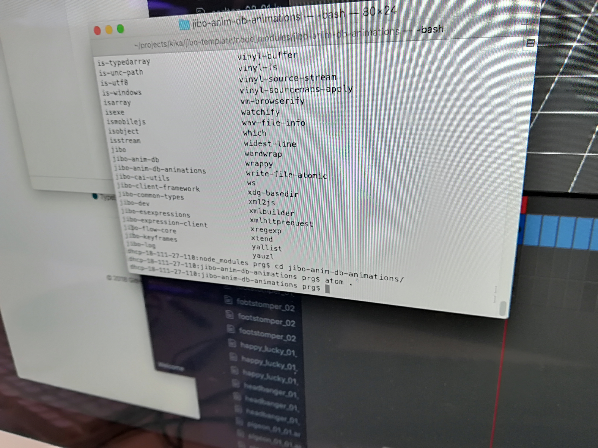
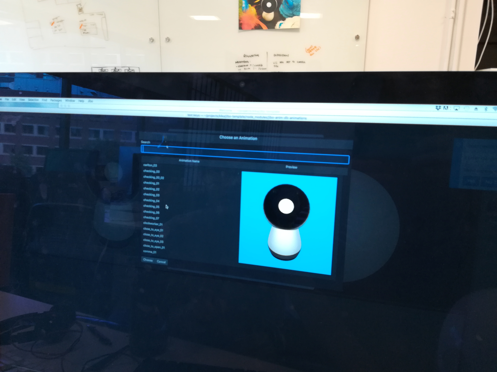
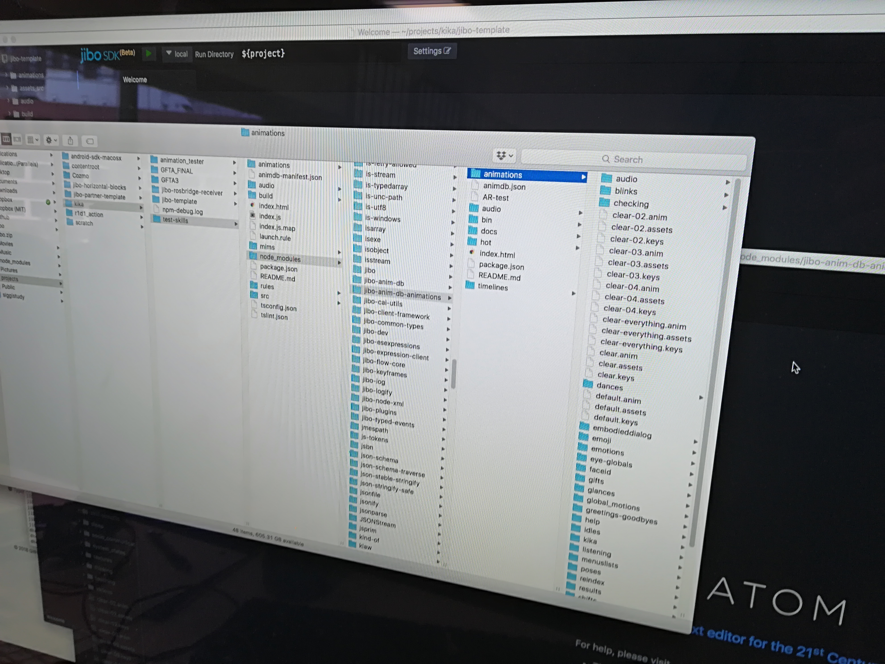
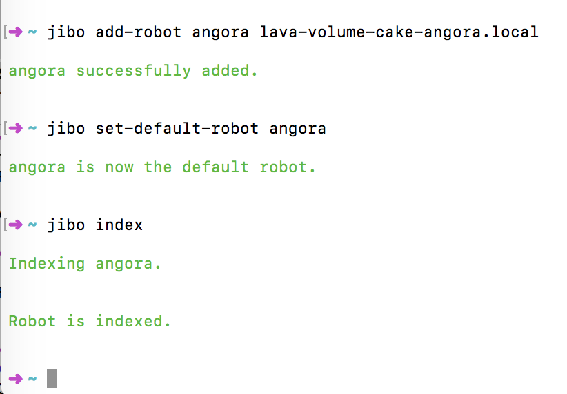
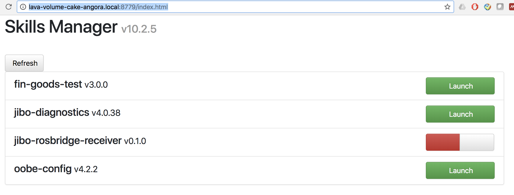

### Manual for iSpy Project (2017 Fall)
### 0. Ubuntu and ROS Installation
1. Install VMWare Fusion and Ubuntu 14.04
2. Install ROS Indigo following the instruction on [the website](http://wiki.ros.org/indigo) 
	* ROS is an important platform for us to do social robotics research here at Media Lab
	* Use Indigo version
3. Basic tutorials on how to use ROS
	* How to run roscore
	* How to suscribe and publish ros messages in Python and in terminal
	* How to build customized ROS messages
	* How rosbridge works

4. Create a short Python script that is able to publish a ROS message if you haven't done so before

5. add the following to your `./bashrc` for ROS IP
	* `export ROS_IP=$(/sbin/ip -o -4 addr list eth0 | awk '{print $4}' | cut -d/ -f1)`
	* or just use the sample bashrc script attached in [this folder](https://drive.google.com/drive/u/0/folders/1sN_nkvlANsVh9SKG-JqsiDVBEWFbZw0q). copy and paste it to your own bashrc file (`./bashrc`) in your Ubuntu and modify it accordingly
	* modify your `./bashrc` file using Sublime editor by typing `subl ./bashrc`

6. Download `git` to both Mac and Ubuntu using `sudo apt-get install git`

7. The default storage size of your ubuntu is 20GB. Use the following video to learn how to increase the size of your vmware partitions to 40GB (or even 60GB). [video link](https://www.youtube.com/watch?v=99ImE9ZlX2s)

8. Wifi and Bridged Network
	* In PRG lab space, please use PRG wifi (either PRG2.4 or PRG5.0). Make sure your ubuntu network is a bridgeted network and the option is "autodetect"
		* 
	* In Ubuntu, make sure there is a double arrow sign on the top right side of your interface
	* do `ifconfig` in Ubuntu to check your IP address. The address should start with `19x.xxx.xxx` rather than `17x.xxx.xxx`
		* `17x.xxx.xxx` is a fake address created by your computer to communicate between mac and ubuntu, so it is not able to communicate between your unbuntu and robot/tablet. Thus, `19x.xxx.xxx` is necessary. 
		* 
	* run `roscore` and then you should see the correct ip address in your terminal
		*
 
### 1. CITI Training

1. Complete the CITI (IRB) training
2. Instructions are below:
	* You first need to install MIT certificate if you don’t have one yet. [Click here](https://ca.mit.edu/ca/)
	* Then go to [the website](http://coeus.mit.edu/coeus/citi/CitiLogin.jsp) 
	* Update your profile, then goto MainMenu. Under “MIT Courses”, click “Add a course”
	* In the orange “IRB courses” category:
		* Social & Behavioral Research Investigators
		* If it’s your first time taking this course, select “I have not previously..”
		* No
	* In the blue “RCR courses” category:
		* RCR for Engineers
	* Click submit, then you’ll see that new courses have been added to your MainMenu.
	* After you finish the course, forward me your certificate and copy Hae Won (our post-doc: `haewon@media.mit.edu`) in the email so that she could add you to our study protocol

### 2. iSpy Game

1. You should have access to all iSpy-related git repos 
	* [iSpy-game-unity](https://github.com/mitmedialab/iSpy-game-unity)
	* [unity-game-controllers](https://github.com/mitmedialab/unity-game-controllers)
	

2. Download them and install them (using ```git clone``` command)
	* download iSpy-game-unity to your **mac**
		* location: ```/Users/[your name]/Projects/```
		* if this directory doesn't exist, creat it first.
	* download unit-game-controllers to your **Ubuntu**.
		* location: ```/home/[YOUR NAME]/catkin_ws/src```
	* make sure you get the master branch for each repo.
3. Become familiar with the iSpy infrastructure. Understand the structure of the code. If you have any questions, please consult with Huili or Sam
	* iSpy game is in Unity
	* iSpy game controller is in Python
	* Check the [iSpy architecture overview doc](https://github.com/mitmedialab/unity-game-controllers/blob/master/iSpyGameController/iSpyGameController%20Overview.md) to learn about its architecture
	* The `unity-game-controllers` contains different unity games, but just becoming familiar with [iSpyGameController](https://github.com/mitmedialab/unity-game-controllers/tree/master/iSpyGameController) is fine

4. Learn how to use rosbridge and send ROS messages via ROS Bridge back and forth between Unity code and Python code
	* Download and install [rosbridge](http://wiki.ros.org/rosbridge_server). Check out its tutorial. 
	* Notice that the communication between the controller and iSpy unity game (either on Unity Editor or on a tablet) is via ROS Bridge
	* The communication between Jibo and Controller is also via ROS Bridge
	* use `roslaunch rosbridge_server rosbridge_websocket.launch` to start the bridge

5. Install all dependencies for iSpy 
	* First install pip3 if necessary. `sudo apt install python3-pip`
	* Install all python dependencies mentioned in `unity-game-controllers/requirements.txt`
		* You may type `make init` in `~/catkin_ws/src/unity-game-controllers` to install python dependencies. Check this [makefile](https://github.com/mitmedialab/unity-game-controllers/blob/ispy-test/Makefile)
			* If you encounter `Permission denied` error, then do `sudo make init` to give the permission to the command line
			* The installation can take a while (~ 10 minutes)  to finish
	* Use `sudo apt-get install python-pyaudio python3-pyaudio` to install pyaudio if necessary
	* May need to upgrade `pip` before installing the dependencies. use `pip3 install --upgrade pip`
	* Use `pip3` to isntall if necessary
	* if you need any other ros project packages, you can find them [here](https://drive.google.com/drive/u/0/folders/1sN_nkvlANsVh9SKG-JqsiDVBEWFbZw0q). Download them and put them into ```/home/[YOUR NAME]/catkin_ws/src``` and do `catkin_make` command in your `catkin_ws` folder
	* may need to install Google ASR. Check how to do so in the Google ASR section below
	
6. Your `catkin` folder should be something like this
	

7. Try to run iSpy game on your machine
	* run ```roscore```
	* run command ```roslaunch rosbridge_server rosbridge_websocket.launch```
	* run ```unity-game-controllers``` using ```./scripts/run_ispy.sh [participant id] [experimenter name] [session number]```
		* Example: `./scripts/run_ispy.sh p00 huili s01`
	* Install [Unity 2017.2.0f](https://unity3d.com/get-unity/download/archive)
	* Open Unity and run the game
		* the ROS ip address should match the ros ip address roscore is running on
		* Click the topleft button to start the mission
		* WHen every mission is finished, click the topleft button to start a new mission
		* A document that explains the game mechanics behind the current iSpy game. Carefully read it understand the game architecture and its features
			* iSpy Game Architecture & Features Doc in the [Link](https://drive.google.com/drive/u/0/folders/1sN_nkvlANsVh9SKG-JqsiDVBEWFbZw0q)

8. Download the iSpy game to an Anroid tablet in PRG (optional)
	* Run the app on the tablet to see if everything works well

9. Consult Huili, Sam or Hanna


### 3. Git commands
1. Learn to use the following commands
	* ```git checkout```
	* ```git add```
	* ```git commit```
	* ```git push```
	* ```git pull```
	* ```git stash```
	* ```git clone```

2. How to update your code to your local branch on github? Do the following.
	* ```git add -A``` to add all files in your project to your Amazon package
		* ```git add XXX.py``` add only ```XXX.py``` to your Amazon package
	* ```git commit - m "XX updated/implemented"``` to leave a receipt for your package and seal the package box
	* ```git push origin [your branch name``` to send your Amazon package to your customer. Specify ```origin [your branch name]``` if this is the first time you udpate your branch on github.
		* Next time, just use ```git push``` because you can have an "express order" for your clients and you have their "mailing address" information already.

3. Use ```git pull``` to update your local git repo before working on your work.
	* Others may have updated the code when you are sleeping. 

4. ```git branch -a``` 
	* list out all branches in the current repo

5. ```git branch``` 
	* print the branch you are in 

6. git status shown in the command prompt
	* if you didn't use the sample `bashrc` file in the folder, then do the following
	* add the following to your `./bashrc`
	* ```parse_git_branch() { git branch 2> /dev/null | sed -e '/^[^*]/d' -e 's/* \(.*\)/ (\1)/' } ```

	* ```export PS1="\n\[$(tput bold)\]\[$(tput setaf 5)\]➜ \[$(tput setaf 6)\]\w\[$(tput setaf 3)\]\$(parse_git_branch) \[$(tput sgr0)\]"```
	* After the modification, the command line in your terminal should be like this
		 where you can see which git branch you are in. IN this screen, the branch is `ispy-test`. 

7. `git push` fails to push a new commit due to a large file that has already been deleted
	* `git filter-branch --index-filter 'git rm -r --cached --ignore-unmatch <file/dir>' HEAD`
	* (more info can be found here)[https://stackoverflow.com/questions/19573031/cant-push-to-github-because-of-large-file-which-i-already-deleted]

9. Everytime when you make a change, push it to your own branch (e.g., Maggie-test) rather than to the master or main branch
	* then send a pull request, and huili will review it and decide whether to merge your branch to the main branch or not


### 4. How iSpy Game, Unity Controller and Robot communicate with each other via ROS?

1. They communicate with each other via ROSBridge
1. For the iSpy unity game, please check file `Assets/Scripts/Utilities/RosbridgeWebSocketClient.cs` and the function `void HandleOnMessage (object sender, MessageEventArgs e)` in it. This function receives the ROS messages that are sent from the controller

2. look at file `GameController.cs` file for `public void OnTaskMessageReceived(Dictionary<string, object> msgParams)`. this function basically recieves the game mission content from the unity controller and then display the content in the unity game. 

3. Notice that `public void OnTaskMessageReceived(Dictionary<string, object> msgParams)` is called in `Assets/Scripts/Utilities/RosbridgeWebSocketClient.cs` by a function called `public void HandleClientSocketReceivedMsgEvent(int cmd, object msgParams)`.

4. ...
5. Last, when you want to virtually move the scene, zoom in zoom out, click an an object, please check the file `UITouchController.cs` that contains all UITouch functions

6. Test whether everything is connected correctly
	* in Ubuntu terminal, type `rostopic list` to get a list of published/suscribed rostopics
	* do `rostopic echo [rostopic name]` to see what this topic publishes


### 5. Deployung and Debugging Apps on a Tablet (Optional)
1. connect your tablet to your laptop. 
2. Make sure `debugging mode` is on on your tablet (in settings)
3. `adb tcpip 5555` to start `adb` debugging 
4. `adb devices` to list all connected devices
5. install Android Studio if you haven't
6. Build your app apk in Unity
7. Open your apk in Android Studio
	* choose `profile or debug APK`
8. Deploy your apk to the tablet and debug in Android Studio
9. `E/Unity: UnauthorizedAccessException: Access to the path`. if this issue exists, then do the following:
	* Make sure in the Unity setting (`Edit/Project Settings/Player`): change th permission from `internal` to `external (sd card)`
	
### 6. Video Recording For Role-Switching Study (Optional)
1. optional 
2. install `ffmpeg` 
	* for Ubuntu 14.04:  `sudo apt-add-repository ppa:mc3man/trusty-media`
	* for Ubuntu 16.04: `sudo apt-add-repository ppa:jonathonf/ffmpeg-3`
	* `sudo apt-get update`
	* `sudo apt-get install ffmpeg`

2. install fonts 
	* `sudo apt-get install ttf-dejavu`

### 7. Deploy audios to Tega (Optional)
1. put all audios to tega phone's sd card.
	* create a different folder and put the audios under the following directory: `contentroot/robots/tega/01/speech`
	* the way to play those audio files is shown in `TegaBehaviors.py`
	* lipsync the audio files: `https://sites.google.com/site/personalrobotsgroupmit/r1d1/toolbox/dragonbot-lipsync`

2. download `HandShaker` in Mac's app store for file transfer on Android devices. This app is a better alternative for `AndroidFileTransfer`

### 8. JIBO Robot (Developer Version)

1. Check out [jibo-rosbridge-receiver](https://github.com/mitmedialab/jibo-rosbridge-receiver) repository and [jibo-template](https://github.com/mitmedialab/jibo-template) repository

2. Check out [jibo-teleop](https://github.com/mitmedialab/jibo-teleop) repository
	* If you don't have access, then download it from [link](https://drive.google.com/drive/u/0/folders/1sN_nkvlANsVh9SKG-JqsiDVBEWFbZw0q)
	* `jibo-teleop` is a program that runs on the Linux side, that 	gives you a teleop interface for controlling a Jibo that is running 	`jibo-rosbridge-receiver` skill it also has the jibo_msg definitions you’ll need to build in your catkin_ws so first check that out, make sure you can install and run that, etc.
	* If you have both `jibo-teleop` and `jibo_msg` in your catkin folder, then delete `jibo_msg` and do `catkin_make` in your terminal
	* if you look at the message defintions for jibo, you’ll see they’re very similar to Tega’s
you send a `JiboAction` typed message with certain fields filled in. for instance, `do_motion`: true. and then motion:`my/path/to/anim.keys`

3. How to create a new animation for Jibo? 
	* in order to add a new animation, you need to first create the `.keys` file, which you can do in the SDK editor that is on PRG's iMac
	* move that newly created animation file `testAnim.keys` to some subdirectory of the `animations` directory of `jibo-rosbridge-receiver`
	* then, you can send a ROS message to play that animation
	* Use one of the iMac computers in PRG to work on Jibo animations
	* Use the Mac desktop on the other side of Huili's table. It has `atom editor` in it. Log into `prg`. Ask others for the password.
	* On the Mac desktop, go to `projects/kika/test-skills/node_modules/jibo-anim-db-animations/` directory and type `atom .`
	* You can reference old animations and merge animations. Creating an animation from scratch may be very time-consuming. merging and changing existing animations is easier and recommended. There are a big set of existing animations. Check the screenshots and if you have questions, feel free to ask Kika.
		* terminal command to start `Atom Editor` 
		* referencing and importing an existing animation. 
		* the location of existing animations
	* a map between Tega and Jibo's animations can be found [here](https://drive.google.com/drive/u/0/folders/1sN_nkvlANsVh9SKG-JqsiDVBEWFbZw0q). 

4. Start from scratch
	* pick a dev Jibo. The robot's name can be found on the bottom of the robot (four words)
	* turn it on. when it is on, should be able to a blue check mark on Jibo's face
	* Make sure the wifi on your local machine is PRG wifi rather than MIT or Media Lab wifi.
	* do `jibo index` in your terminal. make sure the computer has `jibo cli`. You can use PRG's mac, which has `jibo cli`. This `index` command is to reorient jibo and start its motor system
		* make sure your default jibo is the one you are using
		* if not, reset default jibo `jibo set-default-robot [robotName]` or `jibo add-robot [robotname] [robot ip]` make sure you put `.local` after `[robot ip]`
		* 
		* When indexing Jibo, you should see it rotating and reorienting itself
	* go to the Skill Service page (https://YOUR-ROBOT-NAME-HERE.local:8779) and manually launch the skill. Example: `http://lava-volume-cake-angora.local:8779/index.html`
		* 
	* then, launch the `jibo-rosbridge-receiver` skill. More information on how to run the skill is in [jibo-template](https://github.com/mitmedialab/jibo-template). Make sure you have `roscore` and `rosbridge` running before starting this jibo skill.
	* first goal is to get `jibo-rosbridge-receiver` running on the robot, get `jibo-teleop` running on your Ubuntu environment, and see if you can get them to actually communicate and play animations between them
		* if `jibo-rosbridge-receiver` and `jibo-teleop` are running successfully, when you type `rostopic info /jibo` you should see both the publisher and subscriber in the screenshot
			* 
	* Once that’s working, adding new anims and invoking them from the game should be relatively straightforward	
5. Then, check how `unity-game-controllers` is connected to Jibo/Tega
	* what commands does it pass to the robot
	* Learn how to add more robot behaviors/actions to the game
6. How to create `.key` file for Jibo custom animations?
	* Use Jibo SDK Editor on PRG's mac
	* check out `jibo-beta-docs-12.1.6` tutorial in the [link](https://drive.google.com/drive/u/0/folders/1sN_nkvlANsVh9SKG-JqsiDVBEWFbZw0q) 

7. Debug page: `Skills Debug Page http://MY-ROBOT-HOST-NAME.local:9191/index.html`	
8. If you have any questions, Sam is the person you can ask for help

9. Useful terminal commands for `jibo cli`
	* `jibo --help` to see all jibo commands
	* `jibo index`
	* `jibo add-robot <robotName> <robotIpAddress> ` 
		* example: `jibo add-robot angora lava-volume-cake-angora.local` make sure you add `.local`
	* `jibo set-default-robot [robotName]`
	* `jibo remove-robot <robotName>`

### 9. Tega Recordings for iSPy (Optional)
1. check the folder [here](https://drive.google.com/drive/u/0/folders/1XKWfUTtqO9Iu9TbziHFAUxueKslK1hsQ)

### 10. Google ASR
0. Download Google ASR git repository [here](https://github.com/mitmedialab/asr_google_cloud.git)
	* to `catkin_ws/src/`
	* If you don't have access to this repo, you can find the zip file for this repo in the [link](https://drive.google.com/drive/u/0/folders/1sN_nkvlANsVh9SKG-JqsiDVBEWFbZw0q)
1. install google cloud sdk
	* pip install google-cloud
2. get the Google ASR crendential json file from Huili
	Find it [here](https://drive.google.com/drive/u/0/folders/1sN_nkvlANsVh9SKG-JqsiDVBEWFbZw0q)
3. Set the path
	* `export GOOGLE_APPLICATION_CREDENTIALS=$HOME/projects/asr-projects-daf2f64ad0c6.json`
4. Test it by typing `python ros_asr.py` in `~/catkin_ws/src/asr_google_cloud/src` directory
	* The desired output should be like
		 

	


	 